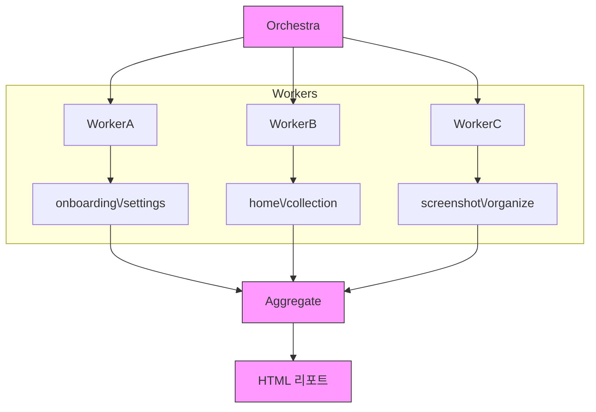

---

layout: post
title: "Agent로 Compose UI QA 자동화하기"
categories: [CMC, Recap]
tags: [android, ai]
description: "Recap을 개발하면서 사용한 스크린샷 QA 자동화"
toc: true
mermaid: true

---

## 도입하게 된 계기

Recap 앱을 개발하면서 피그마 상의 디자인 패턴을 그대로 도입하는 과정에서 일부 컴포넌트에서 고정 높이를 적용하게 되었는데, 높은 글꼴 비율과 작은 화면에서 컴포넌트가 제대로 표현되지 않던 문제가 있었다.

<table>
  <tr>
    <td style="vertical-align:top; text-align:center; padding-right:4px;">
      
      <div><em>고정된 높이에서 텍스트가 clipping됨</em></div>
    </td>
    <td style="vertical-align:top; text-align:center; padding-left:4px;">
      
      <div><em>텍스트 버블이 화면 밖을 넘어감</em></div>
    </td>
  </tr>
</table>

> 기존에 테스트하던 실물 기기는 넓은 화면과 낮은 화면 배율을 가지고 있었는데, 그렇지 않은 기기에서의 사용성을 간과해버렸다.

모든 화면을 작은 기기와 큰 글꼴로 직접 확인하는 것이 어려워 AI 에이전트를 사용한 UI QA 파이프라인 구축의 필요성을 느꼈다.


---

## 설계

### 테스트 환경 정의

이 화면 크기와 글꼴 배율을 조합하여 총 9개의 테스트 케이스를 생성했다.

**화면 크기**
- 320x640
- 360x800
- 412x915

**글꼴 배율**
- 1.0
- 1.3
- 1.5
- ~~2.0~~ _최초 QA에서는 fontScale 2.0까지 포함해 테스트를 진행했으나, 추후 Recap의 실제 지원 상한인 fontScale 1.5에 맞추어 제외하였다._

> 안드로이드 API 34(Android 14)부터는 최대 200%의 시스템 글꼴 배율을 지원하며, 큰 텍스트가 과도하게 커지는 것을 막기 위해 비선형 스케일링이 적용된다. [(참고)](https://developer.android.com/about/versions/14/features?hl=ko#non-linear-font-scaling)

### 스크린샷 생성

각 테스트케이스의 스크린샷 이미지는 [Compose Preview Screenshot Testing](https://developer.android.com/studio/preview/compose-screenshot-testing)를 통해 생성하였다. VM 등의 화면을 에이전트가 직접 조작하는 대신, 동일한 UI State를 9가지의 QA 매트릭스에 따라 렌더링한 뒤 생성된 스크린샷을 에이전트의 입력으로 사용했다. 

처음 이 구조를 구상할 당시에는 Compose에 Screenshot Testing를 위한 별도의 도구가 있다는 사실을 알지 못했다. 작은 화면과 여러 fontScale의 Preview를 생성한 뒤 이를 에이전트가 검수하도록 하는 방식부터 생각했고, 구현 방법을 조사하는 과정에서 Compose Preview Screenshot Testing을 알게 되었다.

Compose Preview Screenshot Testing은 본래 기준 이미지와 현재 렌더링 결과를 비교하는 시각적 회귀 테스트에도 사용할 수 있지만, Recap의 QA 파이프라인에서는 여러 화면 크기와 fontScale 조합의 UI를 일관되게 렌더링해 스크린샷을 생성하는 용도로 활용하였다. 생성된 이미지가 정상적인 레이아웃인지는 이후 에이전트가 별도의 QA 기준에 따라 판단하도록 구성했다.

### QA 기준 정의

- `OVERLAP`: 요소가 의도치 않게 겹침
- `CLIPPING`: 텍스트·아이콘·CTA 등이 잘림
- `HORIZONTAL_OVERFLOW`: 가로로 넘치거나 잘림
- `VERTICAL_OVERFLOW`: 스크롤 없는 고정 레이아웃에서 필수 콘텐츠가 잘림
- `CTA_VISIBILITY`: 필수 액션이 없거나 잘리거나 겹쳐 도달 불가
- `RENDER_ERROR`: Preview 실패, 비정상 blank
- `OTHER`: 위 분류에 안 맞을 때만


### 멀티에이전트의 도입

초기에는 하나의 에이전트가 모든 테스트 케이스를 확인하도록 설계했다. 하지만 40개 화면 x 9가지의 환경에서 생성되는 360개의 스크린샷을 하나의 에이전트가 연속해서 검수하면 context가 지나치게 커지는 문제가 있었다. 이를 해결하기 위해 검증 범위를 feature 단위로 분리하고, 하위 워커가 이슈 후보를 찾으면 메인 오케스트라가 이를 집계하는 구조로 변경하였다.



메인 오케스트라가 모든 워커를 관리하고, 그 아래 하위 워커들이 특정 feature 모듈에 대해 테스트를 진행하는 구조로 설계하였다. Recap의 화면 수와 에이전트의 context 크기를 고려해 이번 QA 파이프라인에서는 각 워커가 2개의 feature 모듈을 담당하도록 구성했다.

### 에이전트의 출력 구조화

하위 워커의 출력은 단순 markdown/텍스트 형식이 아닌 json으로 구조화하였다. 메인 오케스트라가 각 워커의 결과를 다시 집계해야 했기 때문에, 자유로운 텍스트 형식보다는 필요한 정보를 정규화된 JSON 형태로 전달하는 것이 더 효율적이라고 판단했다. 이를 통해 워커마다 표현 방식이 달라지더라도 오케스트라가 동일한 구조로 이슈를 검증하고 HTML 리포트로 변환할 수 있었다.

```jsonc
// 하위 워커의 출력 구조화 예시
{
  "id": "이슈 ID",
  "screen": "이슈가 발생한 화면 이름",
  "test_function": "테스트 함수 전체 경로",
  "severity": "CRITICAL | MAJOR | MINOR",
  "category": "OVERLAP | CLIPPING | ...",
  "summary": "한 줄 요약",
  "description": "상세 현상 설명",
  "components": [ // 관련 주요 컴포넌트명, 복수 가능
    "...",
  ],
  "occurrences": [ // 이슈가 발생한 화면들의 정보 목록, 복수 가능
    {
      "width_dp": "number: 화면 너비(dp)",
      "height_dp": "number: 화면 높이(dp)",
      "font_scale": "number: 폰트 스케일 배율",
      "preview_name": "프리뷰 명칭, 예: '320x640-font150'",
      "image_path": "스크린샷 경로"
    },
  ],
  "healthy_comparison_image": "정상 기준 스크린샷 경로",
  "evidence": [ // 이슈 발생 증거 또는 관찰 내용, 복수 가능
    "..."
  ],
  "probable_root_cause": "추정된 원인 설명",
  "root_cause_file": "근본 원인 추정 파일 경로",
  "recommended_fix_layer": "수정 권장 레이어 (ex. SCREEN, COMPONENT 등)",
  "requires_vm_confirmation": "VM 실제 기기 확인 필요 여부",
  "confidence": "HIGH | MEDIUM | LOW"
}
```

### 사람이 읽기 편한 HTML 리포트 생성

메인 오케스트라가 하위 워커들에게 json 형식의 보고서를 받게 되면, json의 유효성을 확인한 뒤 사람이 읽기 편한 단일 HTML 리포트를 생성하도록 했다. 여기에서 더 나아가 발생한 이슈를 에이전트를 통해 수정하는 파이프라인까지 구현하고 싶었으나, 각 이슈에 대한 처리 방향을 iOS 클라이언트와 맞춰야 하는 이유로 수정 작업을 에이전트가 직접 수행하지 않도록 했다. 디자이너와 함께 수정 방향을 논의하고, iOS 클라이언트와도 공유하며 협업하기 위함이었다.

HTML 리포트는 다음 항목들을 필수적으로 포함하도록 했다. 테스트가 진행될 때마다 리포트의 디자인이 조금씩 바뀌더라도 핵심 내용에는 손실이 없도록 했다.

1. 헤더 - 테스트 실행 시간, 브랜치 명 등
2. 요약 - 테스트가 진행된 모듈 수, 스크린샷 수, 총 이슈 개수, 심각도 별 이슈 개수
3. 이슈 목록 - 모듈 별 테스트 개수, 스크린샷 수, 발생한 이슈 개수
4. 이슈 상세 - 이슈 설명, 발생한 스크린샷, 정상 스크린샷, 근본 원인 추정, 수정 권장 레이어, VM 실제 기기 확인 필요 여부, 신뢰도
5. Cross-module patterns - 2개 이상의 이슈가 같은 원인을 가리킬 때 공통적으로 발생하는 패턴

## 사용 결과

6개 feature 모듈의 40개 화면을 대상으로 360개의 스크린샷을 검수하였다. 첫 QA에서는 6개의 레이아웃 이슈를 발견할 수 있었다. 대부분의 경우 고정된 컴포넌트 높이와 padding으로 인해 발생하는 이슈였다. 다음은 첫 QA에서 발견된 이슈 중 하나의 상세 내용이다.

### 이슈 중 하나: 시작하기 말풍선이 간편로그인과 겹침

- **발생 파일:** `*/OnboardingLandingScreen.kt`
- **원인:** `RecapSpeechBubble`(5초만에 시작하기)을 카카오 버튼 기준 고정 오프셋(`LandingBubbleKakaoGap` 90.dp)으로 배치한다. fontScale이 커져 말풍선과 주변 캡션 높이가 늘어나도 간격이 따라가지 않아 `간편로그인` 구분선과 겹친다.
- **증거:**
  - 320x640 / fontScale 1.3, 412x915 / fontScale 1.5에서 말풍선이 `간편로그인` 라벨과 구분선을 가린다.
  - 카카오 버튼 기준 고정 오프셋을 사용하고 있어 말풍선이 커져도 위로 밀리지 않는다.

<table>
  <tr>
    <td style="vertical-align:top; text-align:center; padding-right:4px;">
      
      <div><em>가장 심한 실패 · 320x640 · fontScale 1.3</em></div>
    </td>
    <td style="vertical-align:top; text-align:center; padding-left:4px;">
      
      <div><em>정상 상태</em></div>
    </td>
  </tr>
</table>

[전체 HTML 리포트](/recap-ui-qa-report/)

## 한계점

멈춰있는 스크린샷을 기반으로 이슈를 판단하기 때문에, marquee 등의 애니메이션이나 제스처 등 움직이는 요소가 적용된 컴포넌트는 이슈 여부를 판단하는데 어려움이 있었다. 의도된 overlap을 문제로 판단하거나, 미묘한 spacing 문제를 놓치는 사소한 문제도 있었다. 

궁극적으로는 디자인 패턴에서 padding과 size에 대한 디자인 토큰이 체계적으로 정의되어 있지 않은 Recap에서는 에이전트가 "보기 좋은가?"에 대해 안정적으로 판단하기 어렵다는 한계를 느꼈다. 즉, 화면에서 관찰 가능한 구조적 오류를 찾는 데에는 유용했지만, 디자인 시스템에 명시되지 않은 미적 판단까지 대신하기는 어려웠다.

## 느낀점

에이전트에게 QA를 완전히 맡기기 위해서는 무엇보다 명확한 QA 기준이 필요했다고 느꼈다. overlap, clipping, overflow처럼 화면에서 객관적으로 관찰할 수 있는 문제는 에이전트가 반복적으로 검증할 수 있었지만, 적절한 간격이나 시각적 균형처럼 디자인 의도가 필요한 영역은 여전히 사람의 판단이 필요했다.

따라서 디자인 토큰이 충분히 정교하게 정의되지 않은 현재의 Recap에서는 에이전트가 이슈 후보를 탐지하고 사람이 최종 검증하는 Human-in-the-loop 구조가 가장 현실적이라고 생각한다. 여러 상태의 화면에서의 이슈 판단을 위해 시작한 이 파이프라인은 QA에 대한 부담을 줄이는 것을 넘어 Android·iOS 간 일관성을 맞추기 위한 근거를 공유하는 데에도 큰 도움이 되었다. 
